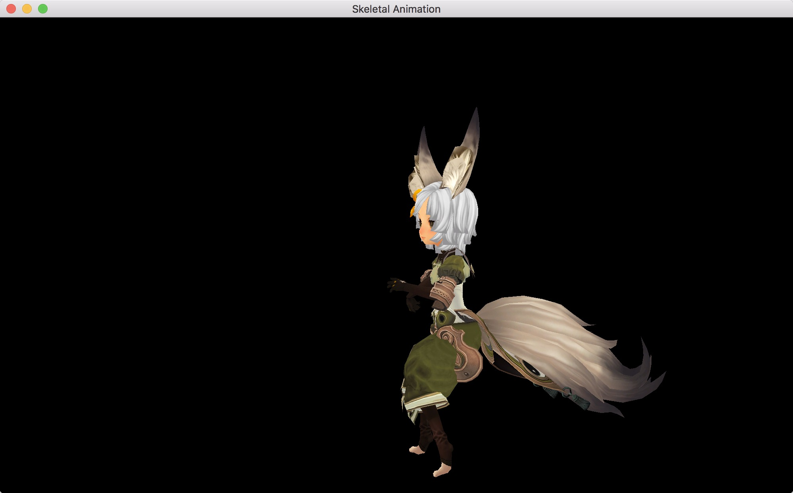

# Skeletal Animation

This repository is a demo of skeletal animation. I use [assimp](http://assimp.org/) to load `fbx` format model including its binding animation. [glm](https://glm.g-truc.net/) is applied to deal with mathematics related works, mainly about matrix transformations. Rendering is implemented with `OpenGL 4.1`.

## Build

### OpenGL

`OpenGL 4.1` is used because `4.1` is the latest version `MacOS` supports. :smile:

### glad

1. Visit this [url](http://glad.dav1d.de/#profile=core&language=c&specification=gl&loader=on&api=gl%3D4.1&extensions=GL_ARB_point_sprite&extensions=GL_NV_point_sprite&extensions=GL_SGIX_sprite) to download `glad.zip`.

2. After extraction, merge `glad/include` with `/usr/local/include`.

3. Compile `glad/src/glad.c` into static library with the following shell script:

   ```shell
   clang -c glad.c
   ar rcs libglad.a glad.o
   ```

4. Copy `libglad.a` to folder `skeletal-animation/lib` in our project.

### assimp, glm and glfw

Use `apt` to install these libraries on `ubuntu`, `brew` on `MacOS` or other package managers.

### premake4

Change your working directory to `skeletal-animation/build` and use [premake4](https://github.com/premake/premake-core) to do the last but one step. Choose your favorite building system, and build it in the last.

## Screenshots

